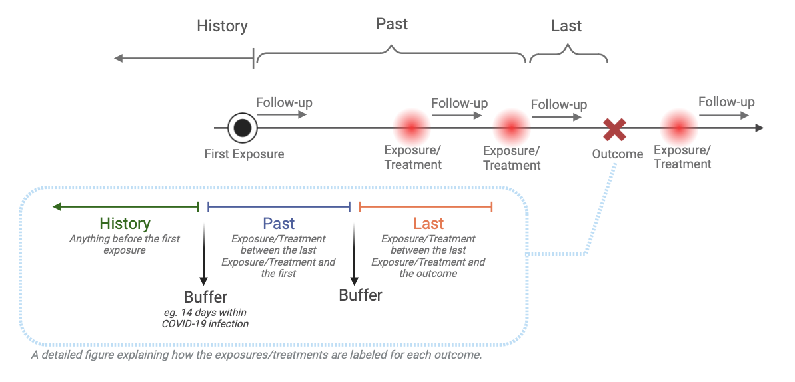

```{r setup, include=FALSE}
knitr::opts_chunk$set(echo = TRUE)
```

## Load packages

```{r package loading}

##update/install MLHO
devtools::install_github("clai-group/mlho")

# load MLHO, afterwards source the MSMR.lite.R file to overwrite the MSMR.lite function
# in the package with the updated one (the encounter functionality is only available in the R file)
library(mlho)

#load and install required dependecies
pacman::p_load(data.table, devtools, backports, Hmisc, tidyr,dplyr,ggplot2,plyr,scales,readr,
                httr, DT, lubridate, DALEX, tidyverse,reshape2,foreach,doParallel,caret,gbm,lubridate,praznik)
library(counterfactuals)
library(iml)
               
```

## Prepare the data

We load several datasets from the MLHO package, including incident data and demographic information.

`dbmart` consists of patient ID (patient_num) and associated phenotypes (phenx). Each patient can have multiple features, including different diagnostic events or conditions.

`labelDT` includes patient ID (patient_num), the start date of each event (start_date), and a binary label (label) indicating the outcome of interest.

`dems` contains dempgraphic information for each patient.

```{r data_loading}
dbmart <- mlho::incident_dbmart
labelDT <- mlho::incident_labeldt
labelDT <- labelDT %>% mutate(o_date=case_when(label == 0 ~ start_date, label == 1 ~ start_date+sample(1:40,1)))
#TODO sex_colum contains only 1 value, resuling in warnings during training -> change in incident datafile from the package 
dems <- mlho::incident_dems
```

```{r}
head(dbmart)
head(labelDT)
```

## Splitting data into training and testing sets using a 70-30 ratio

We extract a unique list of "patient_num" from `dbmart.` Using the list of unique patient ID, we randomly select 30% of these patients to include in our test set.

```{r train_test_split}
uniqpats <- c(as.character(unique(dbmart$patient_num)))


test_ind <- sample(uniqpats,
                   round(.3*length(uniqpats)))

```

## Transform train data

After splitting the data into training and testing sets, the next step is to transform the data to ensure that the data aligns with the requirements of the modeling functions in the MLHO package.

```{r transform_train_data}
dat.train  <- subset(dbmart,!(dbmart$patient_num %in% c(test_ind)))
data.table::setDT(dat.train)
#values must be in column named value
dat.train[,value := 1]
#dat.train$value.var <- 1
uniqpats.train <- c(as.character(unique(dat.train$patient_num)))
```

We use the `MSMR.lite` function from the `MLHO` package to perform a series of transformations and feature selections by labeling each feature by categorizing them to "history", "past", and "last". The parameters include options for sparsity, use of the joint mutual information criterion (`jmi`), the number of top features to select (`topn`), and others that influence how the data is processed and analyzed.



The figure above explains how the features are labeled in `MSMR.lite`. Each patient's data is filtered to process medical encounters sequentially. Events before the first encounter are labeled as "history." For each encounter, data from the current to the last encounter are labeled as "last," and if there is a previous encounter, data from the last encounter to the previous one are labeled as "past." The `buffer` parameter gives flexibility to add a time interval within the infection period. For example, a buffer can be the 14 days of COVID-19 infection by each time label.

Once the data is labeled, all labels (history, past, last) are merged and reformatted into a wide format, where each patient row summarizes counts of each label.

```{r transform_train_data}
MLHO.dat <- dat.train
labels = labelDT
patients <- uniqpats.train
binarize=FALSE
sparsity=0.05
jmi=TRUE
topn=200
patients <- uniqpats.train
multicore=FALSE
encounterLevel=TRUE
valuesToMerge = TRUE
timeBufffer=c(h=-30,p=-30,l=-30)
dat.train <- MSMR.lite(dat.train,
                   labelDT,
                   binarize=FALSE,
                   sparsity=0.05,
                   jmi=TRUE,
                   topn=100,
                   patients <- uniqpats.train,
                   multicore=FALSE,
                   encounterLevel=TRUE,
                   valuesToMerge = TRUE,
                   timeBufffer=c(h=-30,p=-30,l=-30))

```

## Transform test data

We repeat the data processing and transformation again on the test set.

```{r transforma_test_data}
dat.test <- subset(dbmart,dbmart$patient_num %in% c(test_ind))
uniqpats.test <- c(as.character(unique(dat.test$patient_num)))
# remove phenx not required to create the encounter based phenx 
# (remove _last, _past and _history from the colnames to determine the phenxs)
dat.train.colnames <- vapply(strsplit(colnames(dat.train),"_"),`[`, 1, FUN.VALUE=character(1))
dat.test <- subset(dat.test,dat.test$phenx %in% dat.train.colnames)
setDT(dat.test)
#values must be in column named value
dat.test$value <- 1

# important to have a value and phenx column to merge
dat.test <- MSMR.lite(MLHO.dat=dat.test,
                      patients = uniqpats.test,
                      sparsity=NA,
                      jmi = FALSE,
                      labels = labelDT,
                      encounterLevel = TRUE,
                      valuesToMerge = TRUE,
                      timeBufffer=c(h=-30,p=-30,l=-30))


# remove sparse and not relevant _past, _last _history phenx according to the train data
dat.test <- dat.test %>% select(one_of(colnames(dat.train)))

```

## Update demographics and labels Data

The `dems` dataset, which contains demographic information, is updated to include relevant labels from `labelDT`. This integration involves merging both datasets by "patient_num", then modifying the "patient_num" to include the "start_date" for a unique identifier per patient encounter.

```{r update dems and labels}
dems <- dems %>%
  merge(labelDT,by = "patient_num") %>%
  mutate(patient_num = paste0(patient_num,"_" ,start_date)) %>%
  select(-start_date, -label)
```

Similarly, `labelDT` is updated to concatenate "patient_num" with "start_date" to create a unique identifier for each patient's encounter, which simplifies subsequent merging and data handling processes. The "start_date" column is then removed to clean up the dataset:

```{r update dems and labels}
# merge patientnum)and encounter date in labelDT
labelDT <- labelDT %>%
  mutate(patient_num = paste0(patient_num,"_" ,start_date))  %>%
  select(-start_date)

```

## Train model

We use the `mlearn` function to do the modeling, which includes training the model and testing it on the test set.

```{r training}
## we may want to reduce the output of this cell
model.test <- mlearn(dat.train,
                     dat.test,
                     dems=NULL,
                     save.model=FALSE,
                     classifier="gbm",
                     note="mlho_terst_run",
                     cv="cv",
                     nfold=5,
                     aoi="random phenx from dbmart",
                     multicore=FALSE,
                     calSHAP = T,
                     counterfactual = T,
                     save.model.counterfactual = F)

```

## Visualize results

Here we create a plot of the feature importance scores for each of the top (here we have `r nrow(model.test$coefficients)`) predictors identified by MLHO.

To do so, let's map the concept codes to their "English" translation. *That's why we kept that 4th column called `description` in `dbmart`.*

```{r visualisazation}
#TODO FIX! copie from original vignette

features = model.test$features
features$features.new <- sub("_.*", "", features$features )

#TODO fix merge, cut past/last/history before merging the features with the concepts and append afterwards
dbmart.concepts <- dbmart[!duplicated(paste0(dbmart$phenx)), c("phenx","DESCRIPTION")]
mlho.features <- data.frame(merge(features,dbmart.concepts,by.x="features.new",by.y = "phenx"))
datatable(dplyr::select(mlho.features,features,DESCRIPTION,`Feature importance`=Overall), options = list(pageLength = 5), filter = 'bottom')
```

now visualizing feature importance

```{r visualisazation_fig,fig.align='center',fig.width=7,fig.height=7}
#TODO FIX
(plot<- ggplot(mlho.features) +
    geom_segment(
      aes(y = 0,
          x = reorder(DESCRIPTION,Overall),
          yend = Overall,
          xend = DESCRIPTION),
      size=0.5,alpha=0.5) +
    geom_point(
      aes(x=reorder(DESCRIPTION,Overall),y=Overall),
      alpha=0.5,size=2,color="red") +
    theme_minimal()+
   coord_flip()+
    labs(y="Feature importance",x=""))
```

## Counterfactual analysis and visualization

```{r}
counterfactuals.dat = dat.train
model = model.test$counterfactual
predictor = Predictor$new(model, type = "prob")
names(counterfactuals.dat) <- make.names(names(counterfactuals.dat))
x_interest = counterfactuals.dat[1L, ][-1]
predictor$predict(x_interest)
wi_classif = WhatIfClassif$new(predictor, n_counterfactuals = 101L)
cfactuals <- wi_classif$find_counterfactuals(
  x_interest, desired_class = "Y", desired_prob = c(0.5, 1)
)
cfactuals$data
cfactuals$evaluate()
cfactuals$plot_parallel()
cfactuals$plot_freq_of_feature_changes(subset_zero = TRUE)
cfactuals$plot_surface(feature_names = c("X1000126_1_past", "X162864005_1_past"), grid_size = 200)
```

## SHAP value and visualization

When setting `calSHAP=TRUE`, SHAP values are also calculated to explain the output of models as shown below.

```{r}
shap_value <- model.test$shap
head(as.data.frame(shap_value))
```

```{r}
plot(shap_value)
dbmart.concepts.new = mlho.features %>% select(features, DESCRIPTION)
colnames(dbmart.concepts.new) = c("phenx", "DESCRIPTION")
mshapviz(shap_value, dbmart.concepts.new, plot_type = "waterfall", top_n = 6, num = 1)
mshapviz_all(shap_value, dbmart.concepts.new, top_n = 10)
```
